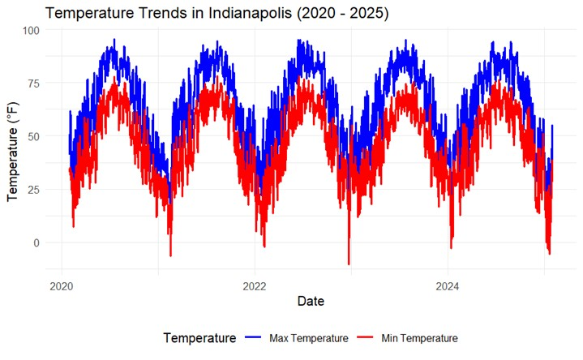
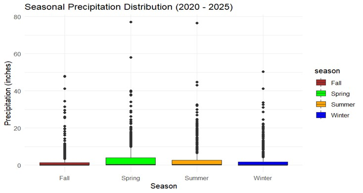
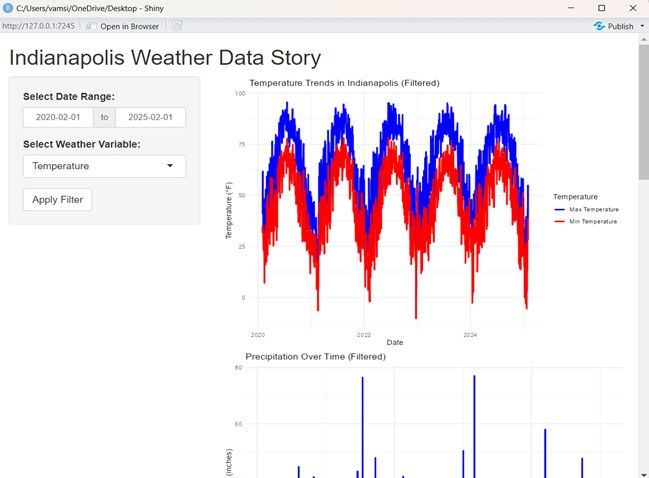
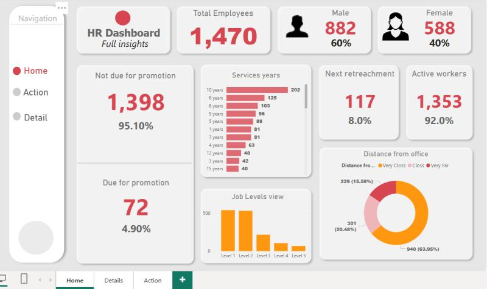
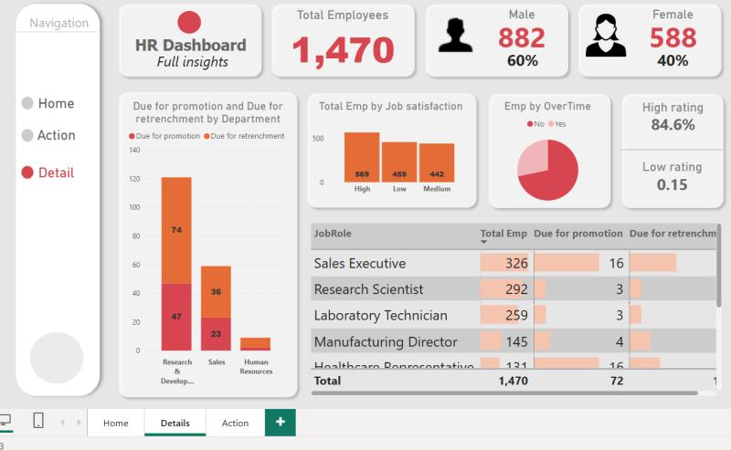
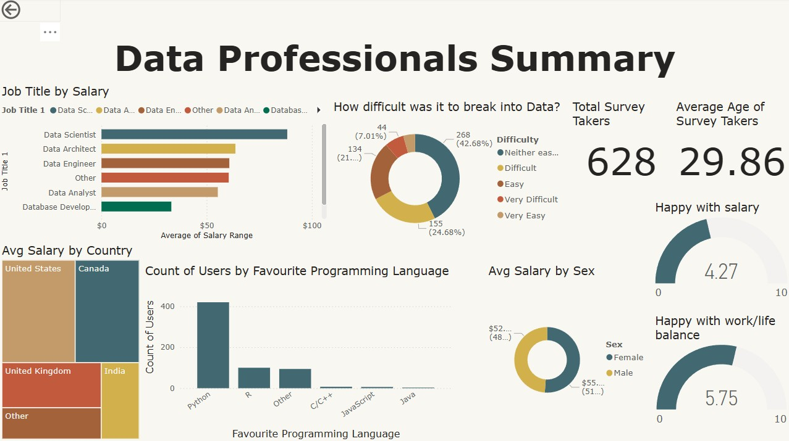
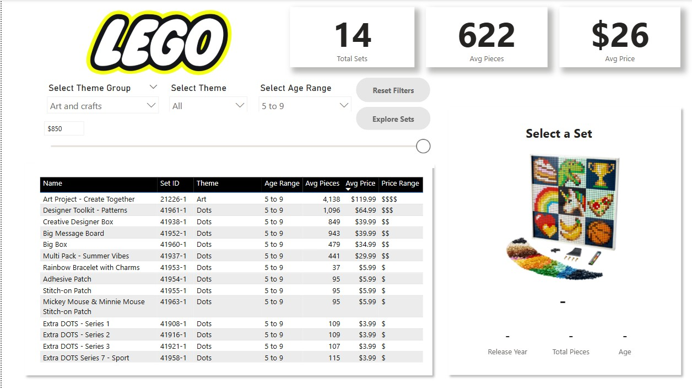

# vamsithota.github.io
# Vamsi Thota's Portfolio | vamsikrishnasait@gmail.com
# Project - 1 : Indianapolis Weather Analysis (2020 - 2025)
### Skills: R (Programming Language) · Quarto · Data Analysis · Statistical Data Analysis · Application Programming Interfaces (API) · Documentation
This project involved analyzing weather trends in Indianapolis from February 2020 to February 2025 using data from the Open-Meteo API. I leveraged R for data acquisition, cleaning, transformation, and visualization, providing valuable insights into temperature, wind speed, and precipitation patterns.

Data Acquisition: I used R packages httr and jsonlite to retrieve daily and hourly weather data, including temperature, wind speed, precipitation, and snowfall, from the Open-Meteo API. The data was parsed from JSON format into a structured data frame for analysis.

Data Cleaning & Transformation: I cleaned the data by handling missing values, converting dates to Date objects, and creating seasonal categories (Spring, Summer, Fall, Winter). This allowed for more targeted analysis, such as identifying temperature extremes and seasonal weather variations.

Exploratory Data Analysis (EDA): I used visualizations such as time series plots, box plots, and bar charts to explore:

Temperature Trends: Revealing seasonal changes, with summer peaks and winter troughs.

Precipitation Distribution: Highlighting variability across seasons, especially intense rainfall in Spring and Summer.

Wind Speed Fluctuations: Identifying wind peaks during winter months and seasonal transitions.

Interactive Dashboard: I developed an interactive dashboard using Quarto and Shiny, enabling users to explore the weather data dynamically. Key features include a date range selector and a weather variable toggle, allowing users to filter data and examine specific weather metrics.

This project showcases my expertise in data wrangling, visualization, and building interactive tools that facilitate data-driven decision-making. It demonstrates the use of R programming and Quarto for creating insightful, real-world applications that make weather data accessible for both technical and non-technical users.

  

# Project - 2 : HR Analytics Dashboard : PowerBi
### Skills: Skills: Microsoft Power BI · Microsoft Excel · Data Visualization
Developed a comprehensive HR Analytics Dashboard in Power BI to provide data-driven insights into workforce management. The dashboard integrates multiple datasets to track employee demographics, attrition trends, hiring patterns, performance analytics, and workforce diversity.

Key Features & Functionalities:
Employee Demographics & Diversity Analysis: Visualized workforce distribution based on age, gender, department, and experience levels to support HR in building a diverse and inclusive workplace.
Attrition & Retention Insights: Identified trends in employee turnover, analyzed reasons for attrition, and provided predictive insights to improve retention strategies.

Performance & Productivity Metrics: Tracked employee performance based on KPIs, enabling HR teams to identify top performers and areas for improvement.

Recruitment & Hiring Trends: Monitored hiring rates, department-wise recruitment efficiency, and new hire success rates to optimize hiring processes.

ETL & Data Processing: Implemented data extraction, transformation, and loading (ETL) pipelines to clean and preprocess HR data for accurate reporting.

Advanced DAX Measures & Calculations: Used DAX functions to create custom metrics for turnover rates, average tenure, and employee satisfaction scores.

Interactive & Dynamic Visualizations: Designed filter-enabled reports, allowing users to drill down into specific departments, roles, and time frames.

Automation & Real-time Updates: Integrated with HR databases and Excel sheets to enable automated data refreshes and real-time workforce monitoring.

This dashboard serves as a decision-support tool for HR teams, helping them identify workforce trends, streamline recruitment, and enhance employee engagement strategies. It empowers leadership with data-driven insights to optimize talent management, workforce planning, and overall HR efficiency.

 

# Project - 3 : Data Professionals Summary : PowerBi
### Skills: Microsoft Power BI · Microsoft Excel · Data Visualization
In this project, I developed an interactive dashboard designed to extract valuable insights from a dataset of over 50,000 survey responses from data professionals. The dashboard provides a comprehensive overview of key trends in salary, career transitions, programming language preferences, and job satisfaction.

Key Insights & Features:

Salary Analysis:
Visualized salary distributions across different roles such as Data Scientist, Data Engineer, and Data Architect. Enabled comparisons of salary ranges across various countries including the United States, Canada, the UK, India, etc. Offered gender-based salary insights to help identify potential pay disparities. 

Career Transition & Challenges:
Analyzed responses regarding the difficulty of entering the data field, categorizing the feedback into levels ranging from Very Easy to Very Difficult. Provided aspiring data professionals with a realistic view of the industry’s entry challenges.

Programming Language Preferences:
Highlighted the most frequently used programming languages among data professionals, with Python leading the list, followed by R, SQL, C/C++, JavaScript, and Java. Job Satisfaction & Work-Life Balance
Evaluated satisfaction metrics such as salary happiness (with an average rating of 4.33 on a 1-10 scale) and work-life balance (average rating of 5.92). Delivered a detailed snapshot of overall job satisfaction within the data field.
This dashboard not only brings clarity to the current trends and challenges within the data industry but also serves as an essential tool for both seasoned professionals and newcomers aiming to navigate their career paths in data.

# Project - 4 : LEGO Themed Interactive Dashboard – Enhancing Product Discovery with Data
### Skills: Microsoft Power BI · Microsoft Excel · DAX · Data Visualization

In this project, I designed an advanced Power BI dashboard to interactively analyze and explore LEGO product data, encompassing over 4,000 rows of records. The solution leverages dynamic filtering, robust DAX measures, custom visuals, and intuitive navigation features to elevate the user experience.

Key Features & Techniques:
Price-Based Filtering:
Implemented a numeric range parameter (0–850 in increments of 5) combined with a slicer and DAX measure to dynamically filter LEGO sets by price.

Interactive Image Tooltips:
Enabled hover-based tooltips that display images of LEGO sets, providing a richer visual context during exploration.

Custom Reset Filters:
Created bookmarks and button actions with customized hover and press states, allowing users to easily reset all applied filters.

Decomposition Tree Analysis:
Integrated a decomposition tree to break down Total Sets by category, theme group, theme, and set name, complete with navigation buttons for seamless data exploration.

Data Modeling & Cleaning:
Connected to a LEGO sets CSV file, streamlined the data by removing unnecessary fields, correcting data types, and filtering out incomplete records.

Advanced Slicers & Interactions:
Developed slicers for theme group, theme, and age range, enabling refined selections while ensuring that top-level KPI cards remain unaffected.

KPI Cards & Measures:
Designed card visuals to display essential insights such as Total Sets, Average Pieces per Set, and Average Price using precise DAX measures.

Conditional Formatting:
Applied custom formatting by defining specific Age Range categories (Over 18, 10–17, 5–9, 1–4) and Price Range labels (from $ to $$$$$) to enhance data readability.

Detailed Set View:
Crafted a dedicated report section that provides detailed information on product attributes (name, image, price, year, pieces, age), utilizing placeholder values when multiple sets are selected.

# Project - 5 : Distributed Deep Learning on Azure – Scaling Neural Network Training for Text Classification
### Skills: Microsoft Azure · AzureML · Convolutional Neural Networks (CNN) · Recurrent Neural Networks (RNN) · Long Short-term Memory (LSTM) · Python (Programming Language) · Machine Learning Algorithms · Statistical Data Analysis · Microsoft PowerPoint

In this project, I developed and refined deep learning models—leveraging CNNs, LSTMs, and Bi-RNNs—for advanced text classification tasks. The focus was on enhancing both predictive accuracy and computational efficiency through dynamic resource allocation and edge computing strategies.

Key Contributions:

Automated Azure ML Pipelines:
Designed and implemented Azure Machine Learning pipelines to streamline data preprocessing, model training, and hyperparameter tuning, ensuring reproducibility and scalability.

Cloud-Based Model Development:
Utilized C# and Python within Visual Studio and the Azure ecosystem to develop and deploy deep learning models, optimizing resource management in a cloud environment.

Sentiment Analysis with NLP:
Processed a dataset of 50K IMDB movie reviews using NLP techniques for sentiment classification, achieving a significant boost in accuracy and efficiency.

Optimized Model Inference:
Integrated Azure GPU-accelerated virtual machines and edge computing solutions to reduce latency and enhance real-time performance during model inference.

Serverless Deployment:
Deployed the optimized models using Azure Functions and Azure Kubernetes Service (AKS) to achieve serverless scalability and efficient resource utilization.

This project highlights my ability to harness cloud scalability and advanced neural network architectures to deliver robust and efficient deep learning solutions.

# Project - 6 : ML Algorithms for Disease Prediction | Web-Based Application
### Skills: Machine Learning Algorithms · Python (Programming Language) · Web Development · MySQL

Developed a web-based disease prediction system using four machine learning (ML) algorithms—Naïve Bayes, Random Forest, Decision Tree, and Support Vector Machine (SVM)—to predict diseases based on user-selected symptoms. This project aimed to assist patients and healthcare professionals by providing early-stage disease predictions through an interactive web application.

Project Overview:
Designed and developed the web application from scratch, enabling users to input symptoms and receive a predicted disease output.
Implemented four ML models to analyze user-inputted symptom data and generate predictions.
Conducted comparative performance analysis of all models using key evaluation metrics:
Accuracy – Overall correctness of predictions.
Precision – How many predicted positive cases were actually positive.
Recall – Ability of the model to detect all actual positive cases.
F1 Score – Balance between precision and recall.
Identified the best-performing algorithm by comparing the metrics and optimizing hyperparameters for improved accuracy.
Built the backend logic in Python, integrating ML models with the web application for real-time predictions.

Technical Stack & Implementation:

Programming Language: Python (Flask for backend, HTML/CSS for frontend)

Machine Learning Algorithms: Naïve Bayes, Random Forest, Decision Tree, SVM

Libraries Used: Pandas, NumPy, Scikit-learn, Flask

Model Training & Testing: Trained models on a dataset containing disease-symptom relationships, then tested performance using a separate validation set.

User Interface: Developed an intuitive web interface where users could select symptoms from a predefined list and receive instant predictions.
